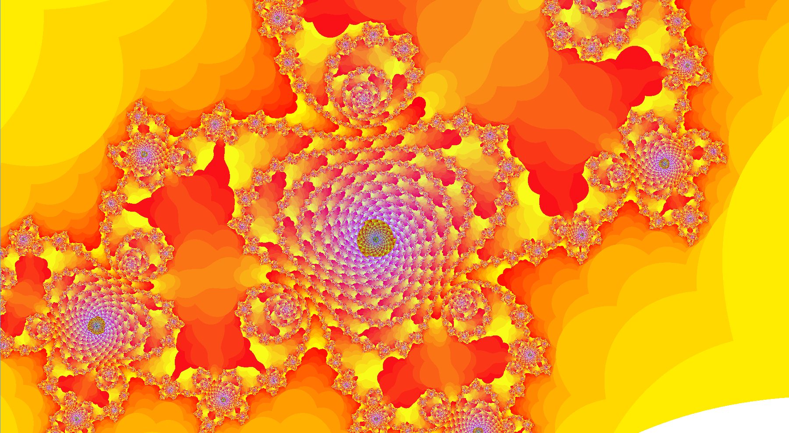

# Mandelbrot and Julia set parallel project

This project was born for my master degree course "Parallel and Distributed Computing Systems". I love the curious pictures that fractals could generate so I chose the _Mandelbrot and Julia set_ to deepen parallel computing. These are the diffrent type of parallelism I've implemented:

* PThread - Posix Thread
* MPI - openmpi implementation of messagge passing
* GPGPU - Cuda on nvidia device

The code is written in C and it has a common part to manage the GUI and the init/end code. It works on linux, so if you use Windows.. please, install linux :)\
The algorithm is what it's called an embarassingly parallel algorithm, there's no dependency between pixels (the data). The architecture is a classic Master-Slave with dynamic tasks assignment, each slave ask for new job and the master assign it.\
In GUI mode it's possibile to move up, down, left, right and zoom-in or zoom-out with the keyboard.
Source files are named with cpp extension for compatibility between different modules compilation.

Note: Please take this project as material of study or just to pick some ideas.
I'm not a genius of parallel computing, I just like it.
Also, I do not rule out that there's no errors in the code (argh!) by the way it output beautiful images.



## Requirements

The project is divided in modules so you can install just the part you need\
__mandatory:__ gcc, libgtk-3-dev, libcairo2-dev\
__one of:__ pthread, cuda-toolkit, openmpi

## Compile the project

Use the makefile to compile the project

```(bash)
make mandel[mpi|pth|gpu|seq]    # compile only mpi or pth,gpu,sequential version
make all                        # compile all versions
make clean                      # delete all object modules and executables
```

## Args

```(bash)
-iter 200                   # maximum of 200 iterations per point
-julia [-r=0.1 -i=-1.2]     # julia set instead mandelbrot
                            # "-r" and "-i" specifies the Complex start constant
-n 56                       # use exactly 56 threads or threads per block on gpu
                            # use -np argument of mpirun for mpi
-g 4                        # granularity of the algorithm, divide the matrix in x parts
```

## Execution examples

```(bash)
./mandel*** args            # graphic output, opens a gtk window
./mandel*** -t args         # textual output, follow the sequence in the config.ini
./mandel*** -t -g args      # textual output and at the end of the sequence,
                            # opens the gtk window and continue in graphic mode
mpirun ./mandelmpi -n 4
```